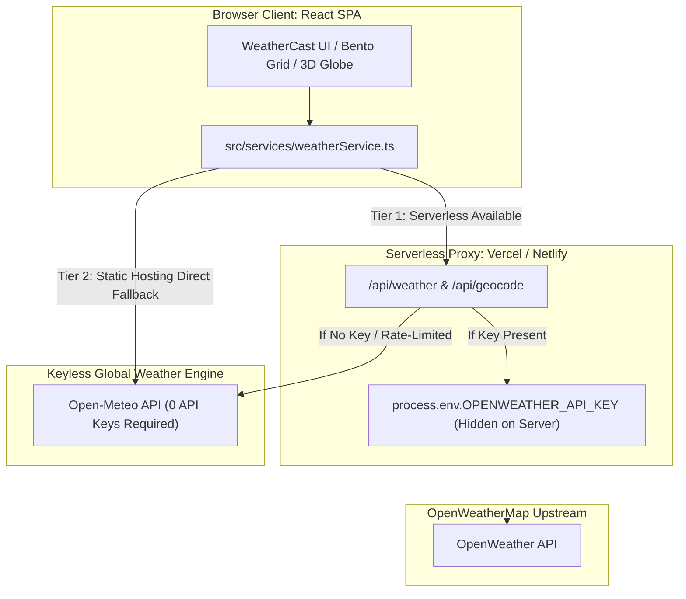

# 🌦️ WeatherCast — Modern Atmospheric Intelligence & Telemetry Dashboard

> A next-generation meteorological telemetry web application built with **React 18**, **TypeScript**, **Three.js**, **Tailwind CSS**, dynamic atmospheric shaders, and a **zero-key exposure dual-engine architecture**.

---

## 🔒 Security Architecture (Zero API Key Exposure)

WeatherCast is designed so that **no secret API keys are ever leaked or bundled into the client-side JavaScript bundle**:



1. **Serverless Proxy Mode (Vercel / Netlify)**: Requests to `/api/weather` and `/api/geocode` run on backend serverless functions. `OPENWEATHER_API_KEY` stays exclusively on the server (`process.env`).
2. **Keyless Live Fallback (Zero-Key Mode)**: If no API key is provided, the backend and frontend automatically use the **Open-Meteo Global Engine**, which provides real live weather for any coordinate on Earth with **0 API keys required**.
3. **Repository Protection**: `.gitignore` strictly excludes `.env` and all secret files from being committed into Git.

---

## 🚀 How to Deploy

### Option 1: Deploy to Vercel (Recommended)

1. Push your repository to GitHub (or import [github.com/shashankpawar0113/weathercast](https://github.com/shashankpawar0113/weathercast)).
2. Go to [vercel.com](https://vercel.com) and click **"Add New Project"**.
3. Select the `weathercast` repository.
4. *(Optional)* Under **Environment Variables**, add:
   - **Key**: `OPENWEATHER_API_KEY`
   - **Value**: `your_openweathermap_api_key`
   *(If omitted, WeatherCast will automatically run on the zero-key Open-Meteo live engine).*
5. Click **"Deploy"**.

---

### Option 2: Deploy to Netlify

1. Go to [netlify.com](https://www.netlify.com/) and click **"Add new site" &rarr; "Import an existing project"**.
2. Select your `weathercast` repository.
3. Build command: `npm run build`, Publish directory: `dist`.
4. *(Optional)* Add environment variable `OPENWEATHER_API_KEY`.
5. Click **"Deploy"**.

---

### Option 3: Deploy to GitHub Pages / Static Hosting

1. Under repository **Settings &rarr; Pages**, choose your deployment branch (or configure GitHub Actions for Vite).
2. The client will automatically operate in **Zero-Key Mode** with Open-Meteo live data, needing zero server infrastructure!

---

## 💻 Local Development

1. **Clone the repository**:
   ```bash
   git clone https://github.com/shashankpawar0113/weathercast.git
   cd weathercast
   ```

2. **Install dependencies**:
   ```bash
   npm install
   ```

3. **Configure Environment Variables (Optional)**:
   ```bash
   cp .env.example .env
   ```

4. **Start Development Server**:
   ```bash
   npm run dev
   ```
   Open `http://localhost:3000` in your browser.

5. **Build for Production**:
   ```bash
   npm run build
   ```

---

## ✨ Features

- 🌍 **Interactive 3D Earth Globe**: Explore global atmospheric coordinates and weather patterns with a Three.js interactive globe.
- ⚡ **Real-Time Weather Telemetry**: Dual-engine telemetry powered by Open-Meteo & OpenWeatherMap.
- 🎨 **Dynamic Atmosphere Engine**: Shaders and particle simulations adapting live to current weather conditions (rain, snowfall, thunder, mist, clear skies, starry nights).
- 📊 **Interactive Hourly & 7-Day Forecasts**: Recharts-powered telemetry graphs and forecasts with dynamic temperature curves.
- 🧭 **Atmospheric Bento Metrics**: UV Index, Pressure gauge, Wind Vector & Compass, Humidity, Visibility, Sun Cycle Arc, and Cloud Density.
- 🔍 **Global Spotlight Search**: Quick keyboard shortcut (`Ctrl+K` / `Cmd+K` or `/`) with live geocoding suggestions.
- 🌓 **Glassmorphic Cyber-Minimalist UI**: Smooth micro-interactions, responsive reactive cards, and high-contrast ambient modes.

---

## 📄 License

MIT License © 2026 Shashank Pawar
